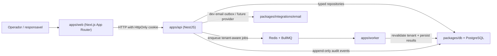

# Phase 1: Foundations and Tenancy - Research

**Researched:** 2026-04-17
**Domain:** Monorepo foundations for a multi-tenant Brazilian billing SaaS
**Confidence:** MEDIUM

<user_constraints>
## User Constraints (from CONTEXT.md)

### Locked Decisions
- D-01: The initial onboarding is self-serve, creates `tenant` and owner user in the same transaction, defaults timezone to `America/Sao_Paulo`, and requires email confirmation.
- D-02: The milestone assumes a single operational owner now, but the schema must be ready for future memberships without full RBAC.
- D-03: Tenant resolution comes from the user's membership tied to the session; no tenant switcher in login.
- D-04: Initial setup captures business name, primary email, WhatsApp phone, timezone, and default due policy.
- D-05: Authentication uses email + password with server-side sessions and HttpOnly cookies.
- D-06: Password recovery uses one-time short-lived tokens delivered by email, invalidated on use, and audited as a sensitive event.
- D-07: Session policy includes explicit logout, inactivity expiry, and session invalidation on password change.
- D-08: Authentication errors must stay generic in the UI; operational detail belongs in audit/observability.
- D-09: Audit trail must cover signup, login, logout, reset request, reset completion, tenant profile changes, and authorization failures.
- D-10: Audit is append-only with actor, tenant, target, type, timestamp, and summarized payload.
- D-11: Audit payload must never store passwords, tokens, or raw secrets.
- D-12: Phase 1 must expose a basic audit view with period, actor, and event type filters.
- D-13: `tenant_id` is mandatory on all transactional and audit entities, including job payloads.
- D-14: API tenant scoping must be centralized and enforced in repositories/services.
- D-15: Every job/worker payload must carry `tenant_id` and revalidate it before I/O.
- D-16: Foundation must include automated tests against cross-tenant access and reusable query-scoping helpers.

### the agent's Discretion
- Pick the monorepo tooling and local developer workflow as long as it supports `apps/web`, `apps/api`, `apps/worker`, `packages/domain`, `packages/db`, and shared testing.
- Pick the session storage implementation as long as it is server-side, revocable, and tenant-aware.
- Pick the development email strategy as long as reset and confirmation flows are testable without a real provider.

### Deferred Ideas (OUT OF SCOPE)
- PSP selection stays in Phase 4.
- WhatsApp BSP vs Cloud API selection stays in Phase 5.
- RBAC, multi-user admin flows, and billing for the SaaS stay out of Phase 1.
</user_constraints>

<architectural_responsibility_map>
## Architectural Responsibility Map

| Capability | Primary Tier | Secondary Tier | Rationale |
|------------|--------------|----------------|-----------|
| Signup, login, reset, settings forms | Browser/Client | Frontend Server | The web app renders the UI and owns navigation/state handoff. |
| Session issuance, password hashing, reset tokens | API/Backend | Database/Storage | Sensitive auth logic must stay on the backend with durable token/session storage. |
| Tenant, user, membership, settings, audit persistence | Database/Storage | API/Backend | PostgreSQL is the source of truth for tenant-scoped state and append-only audit data. |
| Email confirmation and reset delivery | API/Backend | Worker | API requests enqueue or trigger durable delivery paths; worker becomes reusable later. |
| Tenant-aware reminders and future async jobs | Worker | Database/Storage | BullMQ/Redis should own retries and replay-safe background processing. |
| Audit list rendering and filters | Browser/Client | API/Backend | UI renders scoped results; API enforces tenant and filter constraints. |
</architectural_responsibility_map>

<research_summary>
## Summary

Phase 1 should establish a boring, enforceable foundation instead of prematurely optimizing for future payment and messaging integrations. The safest baseline is a `pnpm` workspace monorepo with a Next.js App Router frontend, a NestJS API, a dedicated BullMQ worker, and shared packages for config, domain types, and database access. This keeps the product aligned with the project architecture while making room for future webhook and reconciliation workloads.

For auth, a database-backed opaque session model is a better fit than stateless JWTs for this milestone. It enables forced logout on password change, inactivity expiry, and tenant-aware session inspection without inventing revocation side channels. Pair it with Argon2 password hashing, hashed reset tokens, generic auth errors, and append-only audit logging. For local development, use a dev email outbox adapter rather than binding Phase 1 to a third-party provider.

The critical engineering concern is not scaffolding speed but cross-tenant safety. Repository helpers, Nest guards/interceptors, worker payload validation, and tests must all make tenant context explicit. If the codebase allows "bare" table access or worker jobs without `tenant_id`, later phases will inherit unsafe primitives.

**Primary recommendation:** build the monorepo and shared packages first, then implement database-backed auth/session flows, and finish Phase 1 by hardening audit + tenant-scoping helpers with automated cross-tenant tests.
</research_summary>

<standard_stack>
## Standard Stack

### Core
| Library | Version | Purpose | Why Standard |
|---------|---------|---------|--------------|
| `pnpm` workspaces | latest stable | Monorepo dependency management | Fast installs, deterministic lockfile, simple workspace protocol. |
| `turbo` | latest stable | Task orchestration across apps/packages | Common monorepo task runner with cacheable lint/typecheck/test/build pipelines. |
| `next` | latest stable | Web panel and onboarding UI | Matches the mandated App Router stack. |
| `@nestjs/core` | latest stable | Domain API and auth/webhook surface | Matches the mandated backend stack and supports modular guards/interceptors. |
| `bullmq` | latest stable | Retry-safe async jobs | Standard Redis-backed queue for reminders and replayable jobs. |
| `drizzle-orm` + `drizzle-kit` | latest stable | SQL-first schema and migrations | Matches the mandated data layer and keeps tenant columns explicit. |
| `postgres` or `pg` driver | latest stable | PostgreSQL connectivity | Required by Drizzle and Nest database services. |

### Supporting
| Library | Version | Purpose | When to Use |
|---------|---------|---------|-------------|
| `zod` | latest stable | Shared env and DTO validation | Use for runtime-safe config and cross-app payload parsing. |
| `argon2` | latest stable | Password hashing | Use for owner credentials and password reset completion. |
| `pino` / `nestjs-pino` | latest stable | Structured logs | Use for request/job correlation and operational debugging. |
| `vitest` | latest stable | Unit/integration tests | Use across packages and worker/domain logic. |
| `supertest` | latest stable | API e2e tests | Use for Nest auth and tenant-scope verification. |
| `playwright` | latest stable | Critical onboarding/auth browser flows | Use for signup/login/reset smoke coverage. |

### Alternatives Considered
| Instead of | Could Use | Tradeoff |
|------------|-----------|----------|
| Opaque DB sessions | JWT access tokens | JWTs simplify stateless APIs but complicate revocation and password-change invalidation. |
| `pnpm` + `turbo` | npm workspaces only | Fewer files, but weaker ergonomics once multiple apps/packages start sharing tasks. |
| Dev email outbox | Real ESP in Phase 1 | Real delivery helps realism, but it couples the foundation to third-party setup too early. |

**Installation guidance:** prefer official scaffolders (`create-next-app`, Nest CLI) and pin exact versions at implementation time in `package.json`, not in planning docs.
</standard_stack>

<architecture_patterns>
## Architecture Patterns

### System Architecture Diagram



### Recommended Project Structure
```text
apps/
  web/        # Next.js onboarding, auth, settings, audit UI
  api/        # NestJS auth, tenant settings, audit, worker enqueue surface
  worker/     # BullMQ consumers, tenant-aware async processing
packages/
  config/     # Shared env parsing and app-level config contracts
  db/         # Drizzle schema, migrations, repository helpers
  domain/     # Shared value objects, DTOs, domain constants
  integrations/ # Email/outbox adapters and external service seams
tests/
  fixtures/   # Shared cross-app test helpers
```

### Pattern 1: Opaque Session Tokens
**What:** Generate a random session token, hash it before storage, set the raw token as an HttpOnly cookie, and resolve tenant context through membership on each request.
**When to use:** Authenticated web sessions that require revocation, inactivity expiry, and future multi-user membership support.
**Why:** This avoids JWT revocation drift and keeps password-change invalidation straightforward.

### Pattern 2: Repository-Level Tenant Scoping
**What:** Every repository method receives a `tenantId` or a `TenantScope` object and refuses bare reads/writes.
**When to use:** All transacting reads and writes in API and worker code.
**Why:** The safest anti-leak pattern is to make unscoped access impossible or obviously wrong.

### Pattern 3: Append-Only Audit Event Writer
**What:** Centralize audit writes behind a service that records actor, tenant, event type, target, summarized payload, and correlation metadata.
**When to use:** Signup, login, logout, password reset, settings changes, and future financial/messaging events.
**Why:** It keeps audit semantics consistent and prevents secret leakage in ad hoc logging.

### Anti-Patterns to Avoid
- **JWT-only auth for Phase 1:** makes session invalidation and audit correlation harder than needed.
- **Generic "db" helpers without tenant scope:** encourages accidental cross-tenant queries.
- **Inline job logic inside HTTP handlers:** breaks retries, observability, and future replay safety.
- **Raw secrets in audit payloads or logs:** creates security debt in the first phase.
</architecture_patterns>

<dont_hand_roll>
## Don't Hand-Roll

| Problem | Don't Build | Use Instead | Why |
|---------|-------------|-------------|-----|
| Password hashing | Custom salting/hash routines | `argon2` | Password storage has too many edge cases to own yourself. |
| Session management | Ad hoc cookie structs without durable storage | Opaque DB session table + signed cookie | Revocation, expiry, and auditing become manageable. |
| Queue semantics | Homegrown polling tables | BullMQ | Retries, backoff, and operational tooling already exist. |
| Input validation | Repeated hand-written shape checks | `zod` plus Nest DTO validation | Shared schemas reduce drift across apps. |
| Migration workflow | Manual SQL files only | Drizzle migrations backed by reviewed SQL | Keeps schema history and generated SQL aligned. |

**Key insight:** most Phase 1 risk comes from security and operational edge cases, not from lack of flexibility. Prefer standardized primitives over clever custom infrastructure.
</dont_hand_roll>

<common_pitfalls>
## Common Pitfalls

### Pitfall 1: Cross-Tenant Reads Hidden in "Convenience" Methods
**What goes wrong:** a helper like `findById(id)` gets reused in API or worker code without `tenant_id`, leaking records across tenants.
**Why it happens:** convenience repositories are written before tenant scope is made mandatory.
**How to avoid:** require scoped query builders/helpers from the first migration onward and cover them with cross-tenant tests.
**Warning signs:** methods or controllers that can reach domain tables without a `tenantId`.

### Pitfall 2: Sessions That Cannot Be Revoked Reliably
**What goes wrong:** password change or logout invalidates the current cookie but leaves other sessions active.
**Why it happens:** stateless or partially stateful auth is chosen to move faster.
**How to avoid:** store hashed sessions in Postgres, mark them revoked/expired, and rotate on login/reset.
**Warning signs:** no session table, no last-used timestamp, no concept of revocation reason.

### Pitfall 3: Audit Noise or Secret Leakage
**What goes wrong:** audit becomes useless because payloads are inconsistent, or dangerous because tokens/secrets are logged.
**Why it happens:** engineers write audit rows ad hoc in each handler.
**How to avoid:** centralize audit event creation, define a redaction policy, and test audit payload shapes.
**Warning signs:** free-form JSON logs with reset tokens, cookie values, or provider secrets.

### Pitfall 4: Workers Without Tenant Revalidation
**What goes wrong:** a queued job replays against stale or mismatched tenant context.
**Why it happens:** HTTP code is tenant-aware but worker consumers trust payloads blindly.
**How to avoid:** encode `tenant_id` in the payload, re-read the tenant or membership boundary in the worker, and fail closed.
**Warning signs:** worker handlers that only accept entity IDs and look up records globally.
</common_pitfalls>

<validation_architecture>
## Validation Architecture

- Phase 1 needs fast unit/integration feedback on tenant-scoped repositories and auth services plus slower browser coverage for onboarding/login/reset.
- Wave 0 should establish `vitest`, `supertest`, and `playwright` plus a Docker-based local Postgres/Redis stack for repeatable developer and CI runs.
- Quick feedback target: auth/domain unit tests under 30s.
- Full wave target: API + browser suite under 5 minutes in CI.
</validation_architecture>

<open_questions>
## Open Questions

1. **Email confirmation depth in Phase 1**
   - What we know: context locks email confirmation for signup and reset by email.
   - What's unclear: whether confirmation must block first login in local/dev mode.
   - Recommendation: implement a real confirmation token flow, but allow the dev outbox to expose the link in tests.

2. **How much of BullMQ should be exercised in Phase 1**
   - What we know: jobs must be tenant-aware, but payment/reminder logic arrives later.
   - What's unclear: whether Phase 1 needs more than a proof-of-life audit/outbox queue.
   - Recommendation: wire the worker now with one low-risk queue path so tenant-aware job primitives exist before later phases.
</open_questions>

<sources>
## Sources

### Primary (HIGH confidence)
- `.planning/PROJECT.md` - product constraints, architecture intent, and milestone decisions.
- `.planning/ROADMAP.md` - phase goal, success criteria, and plan boundaries.
- `.planning/REQUIREMENTS.md` - AUTH-01..04 and OPS-01..02 requirement mapping.
- `AGENTS.md` - mandatory stack, multi-tenant, audit, and async conventions.

### Secondary (MEDIUM confidence)
- Current ecosystem experience with Next.js App Router, NestJS, BullMQ, Drizzle, Vitest, Supertest, and Playwright used as implementation guidance.

### Tertiary (LOW confidence - needs validation during implementation)
- Exact package versions and scaffolder flags should be confirmed when dependencies are installed.
</sources>

<metadata>
## Metadata

**Research scope:**
- Core technology: monorepo foundation, auth/session strategy, tenant-scoped data access
- Ecosystem: Next.js, NestJS, BullMQ, Drizzle, PostgreSQL, Redis, testing stack
- Patterns: opaque sessions, append-only audit, worker tenant validation
- Pitfalls: cross-tenant leaks, weak revocation, secret leakage, worker drift

**Confidence breakdown:**
- Standard stack: MEDIUM - stack is fixed by project docs, exact versions deferred to implementation time
- Architecture: HIGH - directly aligned with project constraints and milestone goals
- Pitfalls: HIGH - grounded in the failure modes the product explicitly prioritizes
- Validation approach: MEDIUM - commands depend on the exact workspace scaffold chosen in Wave 1

**Research date:** 2026-04-17
**Valid until:** 2026-05-17
</metadata>

---

*Phase: 01-foundations-and-tenancy*
*Research completed: 2026-04-17*
*Ready for planning: yes*
